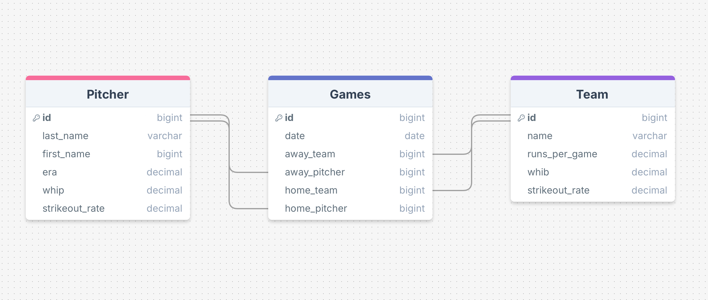
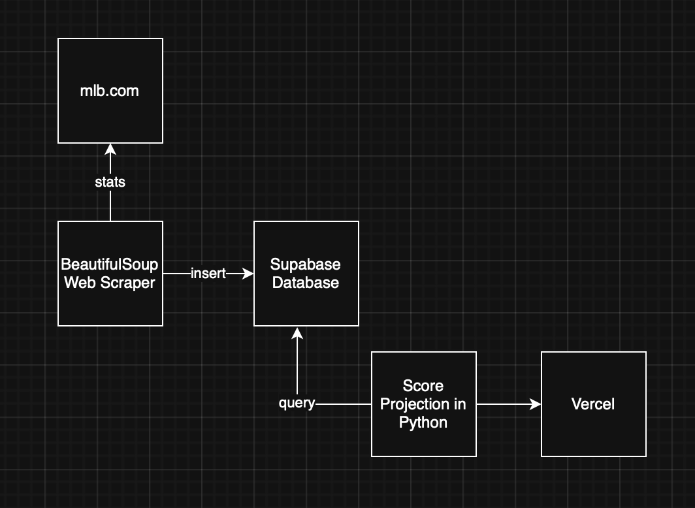

# Fantasy Baseball Pitchers

## Overview

I am in a Fantasy Baseball League with my brothers, my dad, and some friends, and I am looking for a leg up on the competition. The name of the game is to pick the players that are going to perform the best, and that means I would want to pick the pitchers who are playing in a favorable match-up. In other words I want to pick up good pitchers playing against bad teams to maximize the fantasy points they score. This project will look at the stats of pitchers and teams playing each other and give a projection for who would be the best pitcher to pick up that week.

## Web Scraper

My program will use the BeautifulSoup python package as a scraper to scrape the web for baseball stats and baseball match-ups to put into my database.

## Database and ERD

The database will hold match-ups of teams and their starting pitchers. These match-ups will link to correlating stats for the pitcher and the batters of the team they are playing against. It will scrape the schedule from https://www.mlb.com/schedule and the stats from https://www.mlb.com/stats/team.

The database will hold pitcher stats earned runs average (ERA), walks plus hits per innings pitchers (WHIP), and strikeout rate. These stats correspond with the batter stats of runs per game, walks plus hits per innings batted (WHIB), and strikeout rate.

## Hosting Technologies

My database will be in Supabase and the site will be hosted on Vercel.

## Road Map

By Monday June 9th I want my scraper and database to be up and working together. By Wednesday I'd like my logic to be all working together and my front end in Vercel started. By the end of class I'd like it to be up and working for the most part with some opportunities for expansion, such as comparing against specific line ups, factoring in if the pitchers/batters are left handed or right handed, etc.
